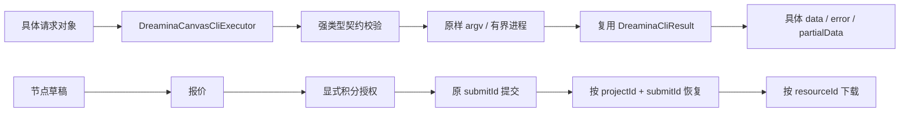

# 即梦画布 Java SDK

契约基线：官方 `dreamina-canvas 1.0.1`，commit `09307bb`，schemaVersion `1`，Java 8。

`DreaminaCanvasCliExecutor` 提供 37 条业务指令的独立请求和具体响应类型，以及帮助和四种 shell
补全请求。参数、位置参数、成功响应、dry-run、错误、恢复上下文均由 Java 对象表达。Canvas 代码不使用 JSON 树、任意 Object 属性或字符串键
option builder。未知服务端扩展仍可从 `getStdout()` / `getStderr()` 原始文本诊断。

## 图片草稿

```java
import io.github.easy4j.dreamina.DreaminaCanvasCliProperties;
import io.github.easy4j.dreamina.cli.DreaminaCanvasCliExecutor;
import io.github.easy4j.dreamina.cli.DreaminaCanvasResponse;
import io.github.easy4j.dreamina.cli.model.DreaminaCanvasNodeCreateImageResult;
import io.github.easy4j.dreamina.cli.opts.DreaminaCanvasNodeCreateImageRequest;
import io.github.easy4j.dreamina.cli.opts.DreaminaRatio;
import io.github.easy4j.dreamina.cli.opts.DreaminaImageResolutionType;

DreaminaCanvasCliExecutor work = new DreaminaCanvasCliExecutor(
    DreaminaCanvasCliProperties.builder().profile("work").build());

DreaminaCanvasResponse<DreaminaCanvasNodeCreateImageResult> result =
    work.nodeCreateImage(DreaminaCanvasNodeCreateImageRequest.builder()
        .projectId(projectId)
        .title("头图")
        .mode("t2i")
        .prompt("一只橘猫，白色背景")
        .model(canonicalModel) // 从 model/list/find 获取当前可调用模型
        .ratio(DreaminaRatio.RATIO_1_1)
        .resolution(DreaminaImageResolutionType.RESOLUTION_1K)
        .count(1L)
        .dryRun(true)
        .build());
if (result.isSuccess()) {
    String action = result.getData().getPlan().getAction();
} else {
    String code = result.getError().getCode();
}
```

每条请求都绑定响应类型；`execute(request)` 与具名方法具有相同的类型推导。`Long` 对应整数，`BigDecimal` 对应数值，`Duration`
对应等待时长，`Boolean` 区分未传值与显式 false。重复参数使用 `List<String>`，builder 拷贝集合，命令值不经 shell，不裁剪提示词。CLI
默认值由 CLI 应用，SDK 不隐式开启生成、积分确认或重试。

## Profile 与画布隔离

每个执行器持有配置快照，每次调用显式发送 `--profile`、`--region` 与 `--non-interactive`。分别创建 `work` 和 `personal`
执行器；登录和本地上下文由 CLI 按 profile 隔离。SDK 不读写或复制凭据。

```java
DreaminaCanvasResponse<DreaminaCanvasCreateResult> created =
    work.canvasCreate(DreaminaCanvasCreateRequest.builder()
        .name("Q4 视觉物料").use(true).build());
String projectId = created.getData().getProject().getProjectId();

work.canvasLs(DreaminaCanvasLsRequest.builder().limit(20L).build());

work.operationWait(DreaminaCanvasOperationWaitRequest.builder()
    .projectId(projectId)
    .operationRef(submitId)
    .timeout(Duration.ofMinutes(5))
    .interval(Duration.ofSeconds(2))
    .build());
```

以上片段的请求与结果类型均位于 `cli.opts` / `cli.model`，`Duration` 位于 `java.time`。所有 node / operation / resource
请求都有 `projectId`，包括 quote、confirm、run、等待和下载。跨设备应显式传 projectId。`canvas ls` 只读，不切换当前画布；
`canvas create.use(true)` 才请求切换。

## 运行与恢复



进程等待与排队共享超时预算，并发限制按执行器隔离，双流输出有上限，中断终止进程并恢复线程中断标记。成功要求退出码为 0 且
`ok=true`；非零退出的结构化错误仍返回 Java 对象，协议损坏或进程异常使用现有异常体系。

`DreaminaCanvasError` 是 CLI envelope 错误；生成服务错误另用 `DreaminaCanvasServiceError` 等具体对象。`meta`、
`partialData`、`creditConfirmation` 均为具名对象，不是通用 map。

## 旧对象与目录

保留原 `cli`、`opts`、`model`、`parser`、`support`、`availability`、`exception` 目录。复用通用配置、argv
接口、原始结果、异常、可用性报告、比例/分辨率枚举，以及版本、账号、设备登录、退出登录对象。

旧 CLI 的已发布方法签名继续兼容，其中旧响应的历史 JSON 树接口仍保留，仅属于旧协议。Canvas
不暴露该旧响应容器。无法直接兼容的旧协议请求保留并标注迁移位置；不会把 sessionId 当成 projectId，也不会把本地文件路径当成资源引用。

## 指令与测试

- [完整参数契约](DREAMINA_CANVAS_COMMANDS.md)
- [指令与 Java 类型映射](validation/dreamina-canvas-types.json)
- [逐对象复用决定](DREAMINA_CANVAS_OBJECT_REUSE.md)
- [指令覆盖与历史真实执行证据](DREAMINA_CANVAS_COMMAND_COVERAGE.md)
- [本轮强类型验收](DREAMINA_CANVAS_TYPED_API.md)

`DreaminaCanvasFieldCoverageTest` 逐指令检查全部参数类型、builder、执行器入口、响应嵌套字段及反序列化。
`DreaminaCanvasCommandCoverageTest` 独立维护 37 条指令的成功/失败 argv 用例。安装态测试比对完整 schema，运行所有帮助、四种补全和本地
dry-run。

`scripts/generate_canvas_types.py` 只从随包、已审阅的 schema 生成具体类型；更新契约后必须重跑字段测试与安装态比对。生成器不运行
CLI，也不授权或提交生成。
