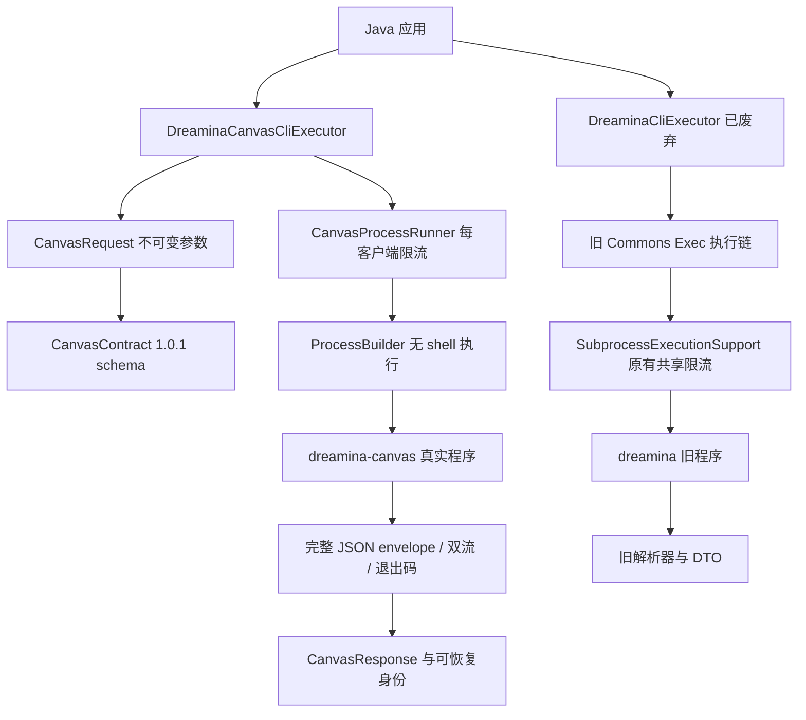

# 首轮 Canvas 迁移与真实单图验收（历史记录）

> 本文保留此前通用请求版本的真实执行证据；当前强类型 API 的验证见 [本轮报告](DREAMINA_CANVAS_TYPED_API.md)。

本报告保留首轮测试与真实图片的历史证据。当前入口为 DreaminaCanvasCliExecutor；最新一轮逐对象审计复用 29 个共享类型、废弃 38
个旧协议专属类型，新增类型统一 Dreamina 前缀； **当前状态见 [对象审计](DREAMINA_CANVAS_OBJECT_REUSE.md)
与 [命令覆盖报告](DREAMINA_CANVAS_COMMAND_COVERAGE.md)**。

日期：2026-09-29。目标仓库 `dreamina-java-sdk`，当前分支 `feature/1.0.x`，起始 HEAD
`5047c7bcc2f21632d408d9a10a40643453e9b2c7`。此变更基于已有 SDK，使用经用户批准初始化的 OpenSpec
`integrate-dreamina-canvas-cli`，已同步两个主规格并归档为 `2026-09-29-integrate-dreamina-canvas-cli`，11/11 tasks
完成；没有创建/切换分支或提交/推送。

## CodeGraph 结构与影响分析

先检查已有图谱，再执行符号与文件探索；源码修改后同步索引。同步结果为 115 文件、2729 节点、6029 关系，索引无待同步源码。同步器仍报告
83 个未解析引用，图谱不是全部动态调用或外部进程的运行证明。

旧 `DreaminaCliExecutor` 图谱显示 23 个调用方，关联 availability、result 与 9
个直接/间接测试入口。新入口单独探索，命令构造、校验和进程执行均可定位到当前源码。通用名称 `execute/run`
会同时命中旧执行器，分析使用完整新文件路径消除歧义。

首轮新链路没有调用旧 Executor、旧静态模型枚举、旧文本解析器或旧共享限流器。入口支持 `execute(request, Class<T>)` 自定义
DTO，同时保留原始 envelope。命令枚举覆盖 37 个业务入口；参数由已安装 CLI 的完整 1.0.1 schema 驱动，动态 model/voice
保持运行时发现。输入生成文本按独立 argv 传递，位置参数用 `--` 隔离。

`DreaminaCanvasCliProperties` 固定非交互 JSON 业务模式，默认 11 分钟总预算、4 并发、每输出流 16
MiB；排队消耗同一预算。超时、中断、输出超限不自动重试。错误分类与消息不包含 token/完整参数。CLI
正常业务错误（包括积分确认和恢复要求）与本地进程/协议错误分离。安装态验收发现错误 JSON 在 stderr，已增加失败回归后修正。

首轮曾为 61 个旧公共类型增加 `@Deprecated` 与迁移 Javadoc；自动逐文件移除这两项新增元数据后，内容与起始 HEAD
完全一致。原有方法签名、参数默认值、错误处理及执行行为保持兼容。新增 Commons Lang3 3.20.0 使用 StringUtils，JDK 8
实际编译验证；共享进程工具与图片工具仍保留可用。

## 测试证据

最终执行 Java 8
`mvn -Ddreamina.canvas.live=true -Ddreamina.canvas.executable=/Users/wandl/.local/bin/dreamina-canvas clean verify`：
**407 项，395 通过，12 跳过，0 失败/错误，BUILD SUCCESS**。12 个跳过来自旧链路的可选检查（10 项真实审计、1 项安装态帮助快照、1
项审计文件解析）；新增 22 项（17 离线 + 5 安装态）全部通过、无跳过。构建日志和 Surefire/JaCoCo 报告已复制到本次本地验收目录。

| 覆盖范围                  | 行覆盖            | 分支覆盖          |
|---------------------------|-------------------|-------------------|
| DreaminaCliExecutor（旧） | 332/332（100%）   | 102/102（100%）   |
| DreaminaCanvasCliExecutor | 61/63（96.83%）   | 32/38（84.21%）   |
| cli.canvas 包             | 311/333（93.39%） | 190/266（71.43%） |

打包产物包含版本化 schema 与 version 资源，Canvas 入口 class major version=52（Java 8）。旧入口原有覆盖率门禁保持不变；新增
Canvas 入口/包均设置 85% 行覆盖率门禁，本次全部满足。没有声称新增分支达到 100%。以下验收项目均由实际调用取得，非计划推断。

- TDD 初始迁移测试：2 个行为断言失败（缺失新入口、缺失废弃注解），随后转绿。
- stderr 业务错误回归：先出现 INVALID_RESPONSE 失败，再修正为结构化返回。
- 新测试覆盖：全部业务入口、字面 argv/中文/引号/换行、重复参数、参数类型与范围、不可变快照、显式批准、10/20 响应、未知字段、DTO
  映射、启动失败、超时、中断、输出上限、独立并发与排队预算。
- 安装态测试严格对比完整 schema，检查全部业务/组帮助、四种 shell 补全（含 no-descriptions），图片/文字/时间线本地
  dry-run。默认不开启，须显式选择；本次已开启运行。

## 真实单图验收

本节承接会话先前的真实生成验收授权，独立于 SDK 默认测试；SDK 本身不会自动执行这些操作。

所有模型查询、画布创建、节点保存、报价、提交、等待和下载均通过编译后的 **Java SDK** 调用。使用 default/cn
已有有效登录态，没有重新登录或修改当前画布上下文。

| 项目           | 实际结果                                                           |
|----------------|--------------------------------------------------------------------|
| Canvas CLI     | 1.0.1 / 09307bb / public / cn                                      |
| 模型与数量     | 实时 model list 发现的 seedream_4.7，1:1，1K，1 张                 |
| projectId      | `56200e1c-dbd7-449d-b245-172d91e75af4`                             |
| nodeId         | `node_5991phj02v`                                                  |
| 固定 submitId  | `cd02aef6-c951-4fe1-b876-292909ead205`                             |
| 报价           | totalMaxCredits=1，confirmationRequired=false                      |
| run            | accepted，仅提交一次，未调用 confirm 或传 yes/token                |
| operation wait | succeeded；submission=completed、resubmittable=false               |
| resourceId     | `7893d064-0635-4eb7-adcf-fb43639af4aa`                             |
| 本地文件       | 987513 字节，1024×1024，实际 PNG                                   |
| SHA-256        | `bad93aebd8c4bee4561bda4798caa5821305b0ca36a7c22aa3c35e462b4ef4bf` |
| 视觉检查       | 橘猫完整坐姿、白色背景，无可见文字或水印，符合验收提示词           |

[打开验收画布](https://jimeng.jianying.com/ai-tool/ai-canvas/56200e1c-dbd7-449d-b245-172d91e75af4)。原始证据与成品位于本次
Codex 本地 `canvas-sdk-acceptance` 目录；该目录不加入 SDK 制品。

实际观察到服务端 operation 资源元数据写 `format=jpeg`，下载文件 magic/解码检测为 PNG。验收按实际内容识别，未将元数据当作格式证明。1
积分是服务端最高报价，未获取最终结算账本，不能等同最终净扣费。

## 验收边界

- 真实生成已验证单张图片。视频、音频、超清、素材上传、登录刷新等入口完成命令契约集成，但没有逐项执行有副作用的真实验收。
- 本地参数检查只覆盖静态可确定条件；远端模型可用性、资源可用性与复杂业务关系由 CLI/Core 校验。
- Java 8 无跨平台进程树 API，客户端终止直接启动的进程；自定义包装脚本不得创建脱离管理的后台进程。
- 旧 CLI 前次真实测试中的账号 `dreamina_cli` 权限拒绝、image2video/frames2video ratio 帮助漂移仍是旧链路边界，本次不声称已修复。
- 图谱、模拟测试、安装态契约、真实单图结果分别提供证据，不能用其中任一项替代其余项。
