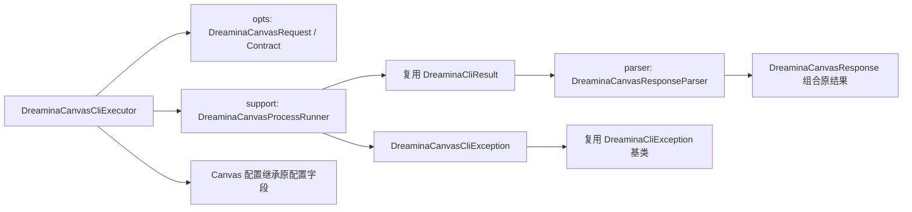

# Canvas 执行器与完整指令覆盖（当前状态）

> 本文保留此前通用请求版本的真实执行证据；当前强类型 API 的验证见 [本轮报告](DREAMINA_CANVAS_TYPED_API.md)。

日期：2026-09-29；Java 8，Canvas CLI 1.0.1 / 09307bb。当前规格变更：`enforce-dreamina-names-and-object-reuse`。

## 目录和对象复用

- 入口已直接改名 `cli.DreaminaCanvasCliExecutor`，无多余别名。
- 保留原目录；没有 `cli.canvas` 生产包。
- 按逐对象审计复用 29 个共享类型、废弃 38 个旧协议专属类型，保留旧成员既有标记。
- 追加兼容 DTO 别名及原检查器 Canvas
  方法；旧请求和执行方法的运行行为保留。详见 [完整对象复用审计](DREAMINA_CANVAS_OBJECT_REUSE.md)。

| 既有位置    | 实现与复用                                                                                                                                                                              |
|-------------|-----------------------------------------------------------------------------------------------------------------------------------------------------------------------------------------|
| 根配置包    | `DreaminaCanvasCliProperties extends DreaminaCliProperties`，复用 executable/workingDirectory/commandTimeoutMillis/maxConcurrentExecutions 等字段，只新增 profile/region/maxOutputBytes |
| cli         | 新执行入口、DreaminaCanvasCommand、DreaminaCanvasResponse；后者组合复用原 DreaminaCliResult 与 DreaminaCliResponse                                                                      |
| cli/opts    | DreaminaCanvasRequest 实现原 argv 接口并复用原比例/分辨率枚举；DreaminaCanvasContract 复用原范围校验，新协议参数由 schema 描述                                                          |
| cli/model   | DreaminaCanvasError 表达 Canvas 业务错误，完整未知字段仍保留在 envelope                                                                                                                 |
| cli/parser  | DreaminaCanvasResponseParser 解析新 envelope，复用已有 Jackson 配置工厂                                                                                                                 |
| cli/support | DreaminaCanvasProcessRunner 保留实例限流、有界输出、中断清理；返回既有 DreaminaCliResult                                                                                                |
| exception   | DreaminaCanvasCliException 继承既有 DreaminaCliException，复用原有 partialResult 诊断快照                                                                                               |

## 覆盖口径

**实际 CLI 调用覆盖：37/37 业务命令 + 5/5 辅助入口 = 42/42。** 37 个业务入口均取得业务成功结果；auth wait
同时覆盖授权等待超时与用户完成授权后的成功返回。帮助与 dry-run 不计为业务成功。

离线 `DreaminaCanvasCommandCoverageTest` 共 75 个独立测试：schema/枚举/测试集一致性 1 项 + 37 条成功响应及 argv 检查 + 37
条 stderr 结构化错误及恢复字段检查。新增 schema 路由而没有枚举或测试时会失败。旧的大循环用例不再作为逐条覆盖的唯一依据。

真实调用均通过 Java SDK 执行。下表的成功是该指令行为成功：例如 video/audio create/edit 是保存与修改草稿，
**不等于生成了视频或音频**。`node run` 使用上一轮已完成的固定 submitId 验证幂等重放；原始单图生成的终态与文件证据见首轮报告。

| 命令                   | 离线成功/失败 | 真实 CLI 结果                                                   | requestId（示例）                    |
|------------------------|---------------|-----------------------------------------------------------------|--------------------------------------|
| `model`                | 通过 / 通过   | 成功                                                            | `202609291349222E2D686438829C718259` |
| `model list`           | 通过 / 通过   | 成功                                                            | `2026092913492249FCD0779000FF2F530C` |
| `model find`           | 通过 / 通过   | 成功                                                            | `202609291349226E35E9004FE2867F7301` |
| `voice list`           | 通过 / 通过   | 成功                                                            | `20260929134922900BC1A75529103B25B9` |
| `node create image`    | 通过 / 通过   | 成功                                                            | `20260929135009F9B472B8FDB02E386036` |
| `node create video`    | 通过 / 通过   | 成功                                                            | `202609291350094A359EEB6A61E32D0CD3` |
| `node create audio`    | 通过 / 通过   | 成功                                                            | `2026092913501062E3283CE356BFDEA844` |
| `node create element`  | 通过 / 通过   | 成功                                                            | `202609291350124D61CE6FD2B89DD70595` |
| `node create text`     | 通过 / 通过   | 成功                                                            | `20260929135013CD77EBF17711FF2C062E` |
| `node create timeline` | 通过 / 通过   | 成功                                                            | `20260929135014DC4E1CE5D1BAEFE39556` |
| `node edit image`      | 通过 / 通过   | 成功                                                            | `2026092913500977EC37CAF0041E359679` |
| `node edit video`      | 通过 / 通过   | 成功                                                            | `202609291350106185468EB120B0307988` |
| `node edit audio`      | 通过 / 通过   | 成功                                                            | `20260929135012E6F8E4DEAAAABC34FFE4` |
| `node edit element`    | 通过 / 通过   | 成功                                                            | `20260929135012D404BA4EC9AA7530D0CB` |
| `node edit text`       | 通过 / 通过   | 成功                                                            | `202609291350134F2550ADF0EEC5455BA5` |
| `node edit timeline`   | 通过 / 通过   | 成功                                                            | `20260929135014CAA951CD7B33642F55CE` |
| `node upscale image`   | 通过 / 通过   | 成功；终态成功，2048×2048 PNG 已下载                            | `202609291351502E2D686438829C71A498` |
| `node show`            | 通过 / 通过   | 成功                                                            | `202609291350146E35E9004FE2867F811E` |
| `node find`            | 通过 / 通过   | 成功                                                            | `202609291350157829C4EE693B05D7135C` |
| `node quote`           | 通过 / 通过   | 成功                                                            | `202609291350159939D2D3AF74A6E79212` |
| `node confirm`         | 通过 / 通过   | 成功；用户明确批准 1 积分上限，仅确认、未发起新生成             | `20260929135911BCA8DD5A352A0D445FBB` |
| `node run`             | 通过 / 通过   | 成功；已完成提交幂等重放                                        | `202609291351495C7E4D2D1F2CB2DCC5CB` |
| `operation status`     | 通过 / 通过   | 成功                                                            | `202609291351485E3C9FDE20057A51ADFC` |
| `operation wait`       | 通过 / 通过   | 成功                                                            | `20260929135335760458651BF5F58CD400` |
| `resource download`    | 通过 / 通过   | 成功                                                            | `2026092913533672A70B3442438C322B5D` |
| `resource get`         | 通过 / 通过   | 成功                                                            | `202609291353361791595C19F7D02DFDB3` |
| `resource upload`      | 通过 / 通过   | 成功                                                            | `202609291350061950E92BF40D5C3FEF08` |
| `canvas create`        | 通过 / 通过   | 成功                                                            | `20260929135004E12AD1E4E98CBA729822` |
| `canvas ls`            | 通过 / 通过   | 成功                                                            | `20260929134923AC62A0ED6DCF50349961` |
| `auth account`         | 通过 / 通过   | 成功                                                            | `202609291349215CBC25DF1BB6A42A9653` |
| `auth login`           | 通过 / 通过   | 成功                                                            | ``                                   |
| `auth logout`          | 通过 / 通过   | 成功                                                            | ``                                   |
| `auth status`          | 通过 / 通过   | 成功                                                            | ``                                   |
| `auth wait`            | 通过 / 通过   | 成功：用户授权后 exit 0、ok=true；同时保留 exit 20 等待超时证据 | 本地认证响应无 requestId             |
| `auth refresh`         | 通过 / 通过   | 成功                                                            | ``                                   |
| `schema`               | 通过 / 通过   | 成功                                                            | ``                                   |
| `version`              | 通过 / 通过   | 成功                                                            | ``                                   |

辅助入口 `help`、`completion bash/zsh/fish/powershell` 实际执行全部成功；安装态测试还覆盖全部分组/命令帮助与
no-descriptions。

## 负向分支与验收边界

- `auth wait`：先使用独立 profile 验证 `cli.login_wait_timeout`（exit 20）；用户完成官方网页授权后，同一授权引用返回 exit
  0、ok=true，随后 auth status 成功。已执行隔离 profile logout 并复查 loggedIn=false，主 profile 仍登录。设备引用与授权 token
  未写入证据文件。
- `node confirm`：先验证独立未登录 profile 返回 `cli.authentication_required`（exit 11）；收到用户明确批准后重新报价为 1
  积分，以 1 积分上限取得确认成功（exit 0）。仅在内存检查凭证存在，未输出、保存或用于新的普通图片生成。
- `node upscale image`：未传 yes/token/ceiling，当前服务端未要求额外确认，已完成正常超清；在受理后只查询原
  submitId，没有重复创建提交。
- 上传后下载的 PNG 与输入 SHA-256 一致；超清 PNG 为 2048×2048、3101350 字节，SHA-256
  `9f5391cc04012b5893e9a2929050d468a71f6b0607fa00e35e8e170885046dad`。
- 这是完整命令路由覆盖，不代表每个模型、每个参数取值组合、所有认证交互或所有计费分支已穷举。

## 可复跑入口

离线覆盖：`mvn -Dtest=DreaminaCanvasCommandCoverageTest test`。安装态只读/dry-run：
`mvn -Dtest=DreaminaCanvasInstalledCliTest -Ddreamina.canvas.live=true test`。带副作用的真实覆盖工具是测试源码中的
`DreaminaCanvasRealCommandCoverageMain`，不由默认测试自动执行；需要显式指定证据目录、真实二进制及阶段。使用 state.json
中固定身份，不能删除状态后重复生成。

[脱敏逐调用证据](validation/canvas-command-coverage-1.0.1.json)。其中只记录命令、状态、错误码和 requestId，不含登录码、认证
token 或签名 URL。

## 最终回归与图谱证据

- Java 8 全量 `clean verify`（开启安装态测试）：498 项，486 通过、12 跳过、0 失败、0 错误；BUILD SUCCESS，全部 JaCoCo 门禁通过。
- 跳过项属于旧 CLI：10 项需要旧认证审计环境变量、1 项需要旧帮助契约开关、1 项缺少既有审计样本文件；不计为已通过。
- 新执行器行覆盖 52/54（96.30%）、分支 20/22；旧执行器行 332/332、分支 102/102，均为 100%。
- 本轮 Surefire 记录 Java 8 JIT CodeCache 连续空间警告，引发 native-stream 提示；测试结果完整、进程正常结束，未把该警告隐藏或视为测试失败。
- 最后新增的只读验收回读工具已重新编译并实际执行：六类节点的类型、身份与编辑后标题一致，主 profile 仍登录。
- 发布 JAR 验证 class major version=52（Java 8），新入口与 schema 路径正确，没有 cli/canvas 生产包。
- CodeGraph 已同步（最终统计见本轮对象复用报告）；图谱核实原 argv 接口、响应容器、DTO、异常和可用性检查的复用调用边。静态图谱仍有第三方/Lombok
  未解析引用，不作为线上成功证明。
- 本轮 auth wait 正向验收已完成；全部 37 个业务路由与 5 个辅助入口均有真实成功结果。命名与复用变更已同步主规格并归档。

证据目录：`/Users/wandl/.codex/visualizations/2026/09/29/01a0eb79-a9cd-79a2-be81-04ff4198b650/canvas-command-coverage/`
，包含逐调用 JSON、确认日志、全量测试日志、Surefire/JaCoCo 报告与下载文件。执行日志和原始报告留在本地，不纳入源码公开文档。

本轮命名/复用回归证据目录：
`/Users/wandl/.codex/visualizations/2026/09/29/01a0eb79-a9cd-79a2-be81-04ff4198b650/canvas-object-reuse`
。此前真实写入与生成仍使用原稳定身份；本轮新增真实授权等待不会重新提交生成。
