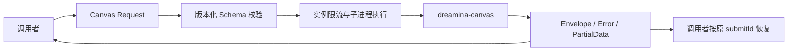

## Context

当前为 feature/1.0.x / Java 8 / Jackson 2.18.9。Canvas 1.0.1 schema 有 46 个命令或组，36 个叶子业务命令；model
组也支持位置参数调用。help 和 completion 不在业务 schema 内，依据各级 --help 单独建模。模型值由实时 model/voice 命令发现。

## Goals / Non-Goals

覆盖当前全部命令和参数，正确保留积分确认与恢复语义，兼容旧接口。非目标：上层调度持久化、自动认证、积分批准、自动重试、付费生成、其他分支和远程发布。

## Decisions

- `DreaminaCanvasCli` 在现有 cli 包；新配置、命令枚举、请求、响应、错误、DTO 与内部支持位于 cli.canvas。
- 请求 Builder 接受命令枚举、位置参数和有类型的选项值。随包 schema 负责参数名、类型、必填和重复性校验，动态模型限制交给运行中的
  CLI。
- 保存完整官方 schema 为资源，同时记录版本与命令目录；对未来未建模字段保留原始 JSON，不提供任意 shell 字符串入口。
- 正常业务退出（包括 10/20/权限拒绝）返回结构化响应；启动、超时、中断、非法 envelope 使用独立异常。错误消息只含命令路径与技术分类，不包含参数或
  token。
- 使用 JDK 8 ProcessBuilder 与实例级 Semaphore，避免复用旧全局限流器。默认进程预算 11 分钟，容纳 CLI 默认 10
  分钟等待；可配置。排队消耗同一个预算。使用两个有界输出读取器并发排空管道；中断/超时显式终止进程，不落盘响应或 token。
- 不新增废弃版本字段，Java 8 仅使用 `@Deprecated`；共享 SubprocessExecutionSupport、图片工具与通用字符串工具保持可用。
- 新代码用 Commons Lang StringUtils，版本取本机缓存的 Java 8 兼容版本 3.20.0。

## Risks / Trade-offs

静态命令目录可能随 CLI 升级过期，显式安装态契约测试负责发现漂移。通用选项 API 不将动态模型列表变成 Java 枚举；提供常用命令便捷方法和可选
DTO 转换。原始响应可能包含认证或积分 token，SDK 不日志记录或自动持久化；调用者需按字段处理。

## Validation

先执行能失败的新增契约测试，再实现。覆盖 argv、不隐式运行、未知参数、重复值、10/20 恢复字段、非零失败、畸形输出、超时、中断、实例限流。执行
Java 8 全套 clean verify、Canvas 已安装 CLI 的 version/schema/help/completion/local dry-run。旧 CLI 真实账户拒绝与旧快照
ratio 漂移是既有问题，独立报告。
